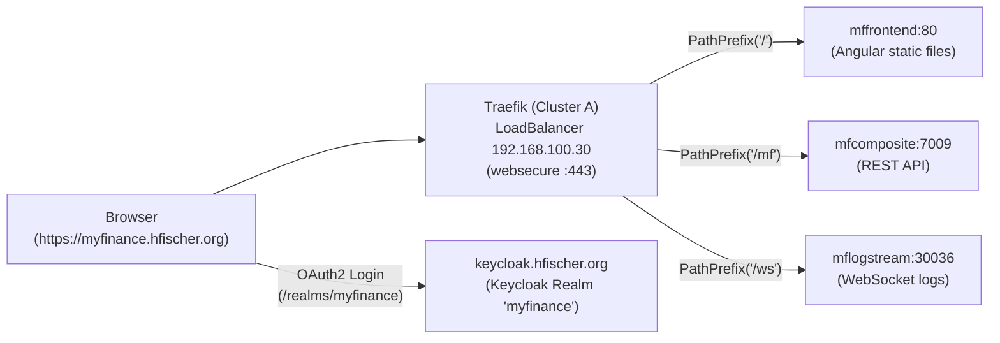

# MyFinance Deployment (`mfdeployment/myfinance`)

This Helm chart deploys the **MyFinance** application stack to Kubernetes. It supports multi-environment deployments managed by ArgoCD (`test` in namespace `mftest` and `prod` in namespace `mfprod`).

---

## 1. Architecture Overview

MyFinance consists of multiple microservices and supporting datastores:

| Component | Technology | Default Port | Description |
| :--- | :--- | :--- | :--- |
| **`mffrontend`** | Angular 18, Nginx | `80` | Single Page Application (SPA) providing the user interface. |
| **`mfcomposite`** | Spring Boot, WebFlux | `7009` | Composite REST API gateway connecting frontend to backend services. All endpoints start with `/mf/`. |
| **`mflogstream`** | Spring Boot | `30036` | WebSocket service pushing log messages to the frontend at `/ws/logs`. |
| **`mfinstruments`** | Spring Boot | `7001` | Service managing financial instruments (accounts, budgets, securities). |
| **`mftransactions`** | Spring Boot | `7002` | Service managing transactions between instruments. |
| **`mfmarketdata`** | Spring Boot | `7003` | Service handling market prices and historical quotes. |
| **`mfvaluation`** | Spring Boot | `7004` | Service calculating portfolio valuations. |
| **`mfsecuritymetrics`** | Spring Boot | `7005` | Service calculating security metrics (e.g. CAGR). |
| **`mfshell`** | Spring Boot | Batch Jobs | Scheduled batch jobs for transaction processing and price imports. |
| **`mfmongo`** | MongoDB | `27017` | Document database with automated Nextcloud backup integration. |
| **`mfrabbitmq`** | RabbitMQ | `5672` / `15672` | Message broker for asynchronous event processing. |

---

## 2. Ingress & Routing Architecture

### Production (`prod`) vs Test (`test`)

- **Production (`mfprod`)**: Accessible publicly and within the home network at `https://myfinance.hfischer.org`. Uses a Traefik `IngressRoute` with Let's Encrypt TLS termination.
- **Test (`mftest`)**: Kept strictly internal using standard Kubernetes `Ingress` resources with `nip.io` hostnames (e.g. `myfinancetest.<master-ip>.nip.io`). The public `IngressRoute` is **disabled** (`ingressRoute.enabled: false`).

### Single Domain Path-Based Routing (`prod`)

To allow accessing the entire application via a single external hostname (`myfinance.hfischer.org`), Traefik routes traffic by path:



- **`PathPrefix('/')`**: Serves the Angular frontend application.
- **`PathPrefix('/mf')`**: Routes all REST API calls directly to `mfcomposite`.
- **`PathPrefix('/ws')`**: Routes WebSocket traffic directly to `mflogstream`.

> [!NOTE]
> Traefik evaluates rule priority by matcher length, ensuring `/mf` and `/ws` are routed to the backends before falling back to `/` for the SPA. Placing frontend and backend on the same origin (`https://myfinance.hfischer.org`) completely avoids Cross-Origin Resource Sharing (CORS) and Mixed Content issues.

---

## 3. Configuration & Values

### Values Files Hierarchy

ArgoCD merges values in the following order:
1. `values.yaml` (chart defaults)
2. `env/values_{cluster}_{stage}.yaml` (environment-specific infrastructure settings, e.g. `values_cluster_a_prod.yaml`)
3. `versions/versions_{cluster}_{stage}.yaml` (container image versions)

### Production Settings (`env/values_cluster_a_prod.yaml`)

```yaml
# Enable Traefik IngressRoute for prod only
ingressRoute:
  enabled: true
  host: "myfinance.hfischer.org"

# OAuth2 Issuer for token validation
keycloak:
  issuerUri: "https://keycloak.hfischer.org/realms/myfinance"

# Runtime configuration mounted into /usr/share/nginx/html/config/config.json
mffrontend:
  config: |
    {
      "zones": [
        {
          "name": "Prod",
          "identifier": "prod",
          "backendurl": "https://myfinance.hfischer.org",
          "openidurl": "https://keycloak.hfischer.org",
          "logstreamurl": "wss://myfinance.hfischer.org/ws/logs"
        }
      ],
      "defaultZone": "prod"
    }
```

---

## 4. Authentication (Keycloak)

1. **Realm**: `myfinance` (managed via OpenTofu in `infrastructure/opentofu/keycloak/myfinance.tf`).
2. **Client**: `mfclient` (Public client with Direct Access Grants enabled).
3. **Redirect URIs**: Must include:
   - `https://myfinance.hfischer.org/*`
   - `http://myfinance*.192.168.100.81.nip.io/*`
   - `http://localhost/*`
4. **Token Validation**: The backend (`mfcomposite`) validates the JWT token against `spring.security.oauth2.resourceserver.jwt.issuer-uri`. Because the browser retrieves tokens from `https://keycloak.hfischer.org/realms/myfinance`, the token issuer claim `iss` matches `keycloak.issuerUri`. JWKs for signature verification are retrieved internally from Keycloak (`http://keycloak.keycloak:8080/...`) to bypass external hairpin routing.

---

## 5. Deployment Workflow (GitOps)

1. **Apply Keycloak changes**:
   Update `infrastructure/opentofu/keycloak/myfinance.tf` and run the OpenTofu Semaphore template to update Keycloak client URIs.
2. **Commit and Push to Git**:
   Commit changes in `mfdeployment` to the `dev` branch.
3. **ArgoCD Sync**:
   ArgoCD will automatically detect the changes and synchronize `myfinance-prod` in the `mfprod` namespace.
4. **Verification**:
   Navigate to `https://myfinance.hfischer.org` in a web browser. Log in with your Keycloak credentials to verify authentication and backend connectivity.
